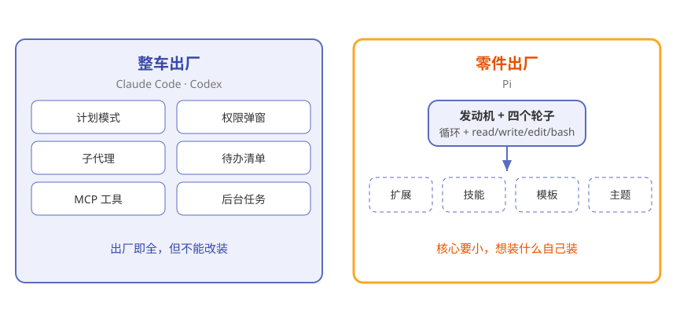
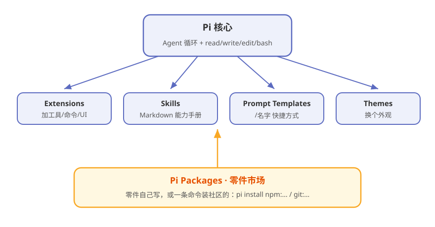
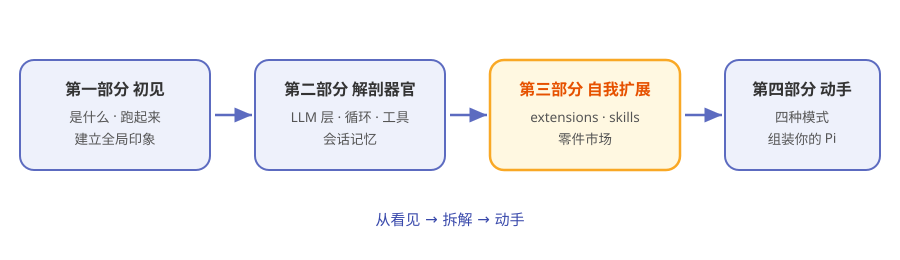

# 第1章 什么是 Pi：一辆附赠零件图纸的车

> **阅读提示**
> 本章回答三个问题：Pi 跟别的编码 agent 有什么不同？它为什么敢"只给 4 个工具"？那些能力都从哪来？约 8 分钟。

## 两种编码 agent，两种态度

你想让 AI 帮你写代码。市面上的产品大致是两种态度。

第一种像买一辆**整车出厂**的汽车：厂家把导航、天窗、座椅加热、辅助驾驶全装好了，你拿到手就能开。Claude Code、Codex 就是这类。好用，但你想换个轮胎、加个行李架，厂家会说"不好意思，不能改装"。

第二种像买一辆**附赠零件图纸**的车：你拿到手的是发动机和四个轮子，外加一整套工具和图纸。想装什么，你自己装，或者去零件市场买现成的。

**Pi 就是第二种。**

图1-1 画出了这两种态度的区别：

**图1-1 两种编码 agent：整车出厂 vs 零件出厂**

## 最小到极端：只有 4 个工具

你第一次打开 Pi，可能会觉得"是不是装错了"。

它默认给 AI 模型的，只有**四个工具**：

**表1-1 Pi 默认的 4 个工具**

| 工具 | 干什么 | 生活类比 |
|---|---|---|
| read | 读文件内容 | 翻开一本书 |
| write | 写新文件 | 写一页新纸 |
| edit | 改已有内容 | 划掉一段改写 |
| bash | 跑一条命令 | 按一个按钮 |

没了。没有"搜索全网"，没有"生成图片"，没有"管理待办"。

这不是作者偷懒。Pi 的官方 [README](https://github.com/earendil-works/pi) 里有一句话把态度挑明了：

> **Adapt pi to your workflows, not the other way around—without having to fork pi internals.**
> （让 Pi 适应你的工作流，而不是反过来——而且不需要你 fork 掉 Pi 的内部实现。）

翻译成人话：**是你改 Pi，不是 Pi 改你——而且不用拆开 Pi 的肚子去改。**

## 六件"故意不做"的事

为了证明这不是嘴上说说，Pi 的 README 里专门列了一份著名的清单——六样别的 agent 抢着内置的东西，Pi **故意不做**：

**表1-2 Pi 的六条"故意不内置"**

| 不内置 | 别人通常怎么做 | Pi 的答案 |
|---|---|---|
| No MCP | 内置工具连接协议 | 用扩展装 |
| No sub-agents | 内置"agent 调子 agent" | 用扩展实现 |
| No permission popups | 每步都弹窗问你 | 用扩展做权限门 |
| No plan mode | 内置"先计划后执行" | 用扩展自己造 |
| No built-in to-dos | 内置任务清单 | 官方直接给了个 todo 扩展示例 |
| No background bash | 内置后台任务 | 用扩展实现 |

看出规律了吗：**每一条"不做"，后面都跟了一条"扩展"的活路。**

这就是理解 Pi 的钥匙——它不是没有能力，而是把"要不要这个能力"的选择权交还给你。

## 那能力到底从哪来

核心这么空，Pi 怎么干活？答案是：**扩展（extensions）**。

Pi 的[官方文档](https://pi.dev/docs/latest)开头第一句就是一句加粗的话：

> **pi can create extensions. Ask it to build one for your use case.**
> （Pi 能自己造扩展。开口让它给你造一个。）

没看错——**你可以直接对 Pi 说"给我写个能 XX 的扩展"，它会自己写、自己装、自己热加载。**

图1-2 就是 Pi 的完整样子：一个极小的核心，外面围着一圈随时可装的"零件"：

**图1-2 Pi = 最小核心 + 四种零件**

**表1-3 Pi 的四种"零件"**

| 零件 | 是什么 | 类比 |
|---|---|---|
| Extensions | TypeScript 模块，能加工具/命令/UI | 给车加一个新功能 |
| Skills | Markdown 能力包 | 塞一本说明书 |
| Prompt Templates | `/名字` 展开的提示词快捷方式 | 一键宏 |
| Themes | 外观主题 | 换个喷漆 |

这些零件，你可以自己写，也可以从社区的"零件市场"（Pi Packages）直接装——第 10 章细讲。

## 那 Pi 到底是什么

现在可以给一句话定义了：

**Pi 是一个开源的、核心极简、可自我扩展的编码 agent harness。它跑在终端里，哲学是"核心要小，一切交给扩展"。**

**表1-4 Pi 的三个关键词**

| 关键词 | 说明 |
|---|---|
| 终端原生 | 纯文本交互，装完就跑，不挑 IDE |
| 最小核心 | 循环 + 4 个工具，就是全部底层 |
| 自我扩展 | 扩展可写、可装、可热加载，甚至能让 Pi 给你写扩展 |

相关链接：[Pi GitHub 仓库](https://github.com/earendil-works/pi) · [官网 pi.dev](https://pi.dev) · [官方文档](https://pi.dev/docs/latest)

## 同类这么多，为什么学 Pi

**表1-5 Pi 与同类对比**

| 名字 | 它是什么 | 能完全接管吗 |
|---|---|---|
| Claude Code | Anthropic 的成品 agent | ❌ 闭源，只能用不能拆 |
| Codex | OpenAI 的成品 agent | ❌ 同上 |
| DeepSeek Harness | DeepSeek 开源的 agent 零件库 | ✅ 一切皆插件，可逐器官研究 |
| **Pi** | **开源极简 harness + 扩展市场** | ✅ **核心最小、扩展最彻底** |

如果你读过本系列上一本《从零读懂 DeepSeek Harness》，正好对照着看：**Harness 是把所有零件都摆给你看，Pi 是只给你发动机，然后教你自己造零件。** 两本合起来，就是"agent 该怎么造"的完整光谱。

本书的讲法也按"从看见到拆解到动手"递进（图1-3）：

**图1-3 全书路线图**

## 🧪 本章实验

> **实验 1-1 ★｜看看这台车的图纸**
> 目标：对 Pi 的哲学建立第一印象。
> 步骤：打开 [Pi 的 GitHub 仓库](https://github.com/earendil-works/pi)，只看三样——README 里 "Pi Agent Harness" 那句、Philosophy 一节里那排 "No"、文档开头那句 "pi can create extensions"。
> 验收：你能说出"这个项目是故意把自己做小的"。

> **实验 1-2 ★★｜检查电脑准备好了没**
> 目标：确认本机 Node.js 版本。
> 步骤：终端输入 `node -v`。
> 验收：显示 v22+ 就万事俱备；否则先去 [nodejs.org](https://nodejs.org/) 装一个。第 2 章要用。

## 🤔 思考题

1. ★ "核心要小，一切交给扩展"——这种设计的代价是什么？它不适合谁？
2. ★★ Pi 故意不内置"权限弹窗"，而是让你用扩展自己实现。你觉得这是对安全负责的态度吗？为什么？
3. ★★ 如果让 Pi 给你造一个扩展，你最想先造什么？

## 📝 小结

- **Pi 是开源的编码 agent harness**——跑在终端里，earendil-works 团队出品
- **最小核心**——默认只给模型 read、write、edit、bash 四个工具
- **六条"故意不内置"**——不做 MCP、子代理、权限弹窗、计划模式、内置待办、后台 bash
- **一切靠扩展**——extensions、skills、提示词模板、主题四种零件，可装可写，Pi 还能给你写
- **学它的价值**——"极简 + 自我扩展"这一派 agent 设计的最彻底标本

下一章，亲手把这台车发动起来。➡️ [第2章 5 分钟跑起来](ch02.md)
