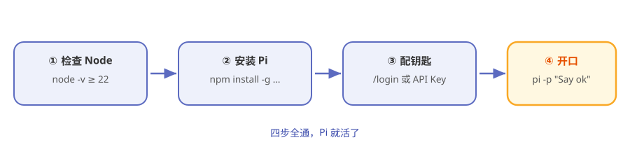

# 第2章 5 分钟跑起来

> **阅读提示**
> 本章只干一件事：把 Pi 装到你电脑上，让它说出第一句话。不解释原理，跟着做就行。约 6 分钟。

## 新车到手，先拧钥匙

上一章我们把 Pi 的图纸看了个大概。这一章不看图纸了——直接上车，拧钥匙，听个响。

它要是能开口说话，后面每一章你读起来都有底气。

## 出发前检查一样东西

Pi 是个 Node.js 程序，所以只依赖一样东西：**Node.js 22 或更高版本**。

终端里敲：

```bash
node -v
```

看到 `v22.x` 或更高就过关。版本号不够或提示"找不到命令"，去 [nodejs.org](https://nodejs.org/) 装一个长期支持版（LTS），装完重开终端再试。

## 一条命令装 Pi

Pi 的旗舰产品叫 `pi-coding-agent`，发布在 npm 上。全局安装：

```bash
npm install -g --ignore-scripts @earendil-works/pi-coding-agent
```

> **阅读提示**
> `--ignore-scripts` 是官方 README 推荐的装法——跳过依赖的安装脚本，装得干净又快。

装完敲一下 `pi --version`，能报版本号就说明装上了。

不喜欢 npm 的话，官方还有一键脚本（macOS/Linux）：

```bash
curl -fsSL https://pi.dev/install.sh | sh
```

## 给它配把"钥匙"

Pi 自己不带大脑，大脑是云端的大模型。所以你得先告诉它用谁家的大脑、怎么进门。两条路任选：

**表2-1 两种配钥匙方式**

| 方式 | 适合谁 | 怎么做 |
|---|---|---|
| 订阅登录 | 有 Claude Pro/Max、ChatGPT Plus/Pro 等订阅的人 | 跑 `pi`，里面敲 `/login`，跟着浏览器走 |
| API Key | 有 API 额度的人 | 设一个环境变量，比如 `ANTHROPIC_API_KEY` |

用 API Key 的话，终端里先设好（以 Anthropic 为例，Windows PowerShell 把 `export` 换成 `$env:`）：

```bash
export ANTHROPIC_API_KEY="你的key"
```

Pi 支持[30 多家模型提供商](https://pi.dev/docs/latest)，不止这一家，第 4 章细讲。

## 第一枪：让它说个 ok

先别急着聊天，用最小的一发确认全链路通了。`-p` 是"print 模式"——问一句、答一句、不进入交互界面：

```bash
pi -p "Say exactly: ok"
```

屏幕上干净利落地蹦出一个 `ok`，就说明：**安装成功、钥匙有效、模型能连上。** 这一枪通了，后面就一路坦途。

图2-1 是从零到开口的完整流程：



**图2-1 从零到 Pi 开口的四步**

## 坐下来聊第一句

确认通了之后，直接敲 `pi` 进入交互界面：

```bash
pi
```

你会看到一个干净的终端对话框。随便打一句，比如：

```
用一句话解释你自己
```

它会流式地把字一个个吐出来，末尾还带 token 用量。恭喜——这台车已经能上路了。

想退出，按两下 `Ctrl+C`，或者敲 `/exit`。

## 出了问题看这里

**表2-2 常见翻车与对策**

| 现象 | 多半是 | 怎么办 |
|---|---|---|
| `pi: command not found` | 全局 bin 不在 PATH | 重开终端；或检查 npm 全局目录是否在 PATH |
| 一直转圈不说话 | 网络到不了模型服务 | 检查代理；或换个提供商 |
| 报认证错误 | 钥匙没配对 | 重设环境变量，或 `pi` 里重新 `/login` |
| 版本太老报错 | Node 不够新 | 升级到 Node 22+ |

> **注意**
> Pi 迭代很快，命令和报错可能跟书上不完全一样。**以你本机跑出来的为准。**

## 🧪 本章实验

> **实验 2-1 ★｜让 Pi 报个到**
> 目标：跑通最小链路。
> 步骤：装好并配好钥匙后，运行 `pi -p "Say exactly: ok"`。
> 验收：屏幕出现 `ok`。

> **实验 2-2 ★★｜问它三个问题**
> 目标：体验交互模式。
> 步骤：运行 `pi`，依次问"你是什么""你默认用哪个模型""你能用哪些工具"。
> 验收：它能答出自己默认只有 read/write/edit/bash 四个工具——印证第 1 章。

## 🤔 思考题

1. ★ 为什么 Pi 要先"配钥匙"才能用？这跟它"不带大脑"的设计有什么关系？
2. ★★ `pi -p` 和 `pi` 一个非交互、一个交互，你觉得分别适合什么场景？

## 📝 小结

- **只依赖 Node.js 22+**——一条 `npm install -g` 装好
- **要配钥匙**——订阅 `/login` 或 API 环境变量二选一
- **`pi -p "..."` 是最小验证**——蹦出 `ok` 就全通
- **`pi` 进交互界面**——坐下正式聊

车会上路了。下一章，打开引擎盖，看看这台车到底由哪些零件构成。➡️ [第3章 俯瞰地图：Pi 的 10 个包](ch03.md)
