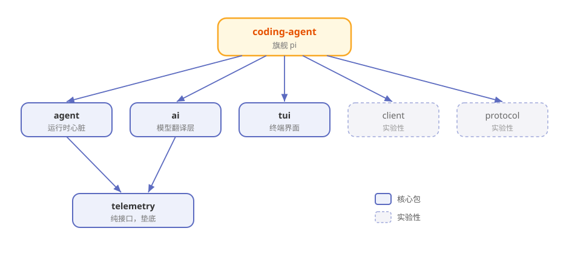

# 第3章 俯瞰地图：Pi 的 10 个包

> **阅读提示**
> 本章带你站在高处看一眼 Pi 的全貌：它由哪 10 个包组成、谁是核心、数据怎么流。读完你手里就有了一张全书共用的地图。约 9 分钟。

## 打开引擎盖，先看零件清单

第 2 章你把 Pi 开起来了。但你可能注意到，装的是一个叫 `pi-coding-agent` 的东西，而仓库里却躺着十个文件夹。

这就像你买了一台车，打开引擎盖发现里面不是一整块铁，而是一堆各司其职的零件。Pi 的仓库（[earendil-works/pi](https://github.com/earendil-works/pi)）就是一个 **monorepo**——一个大仓库里装着多个独立的 npm 包。

先别急着拆开，我们把零件清单过一遍。

## 十个包，一人一句话

**表3-1 Pi 的 10 个包**

| 包 | npm 名 | 一句话职责 |
|---|---|---|
| coding-agent | `pi-coding-agent` | 旗舰产品：你在终端里敲的 `pi` 就是它 |
| agent | `pi-agent-core` | 运行时心脏：agent 循环、工具执行、状态管理 |
| ai | `pi-ai` | 统一 30+ 家大模型的"翻译层" |
| tui | `pi-tui` | 终端界面库：Pi 的屏幕就是它画的 |
| telemetry | `pi-telemetry` | 遥测"合同"：只定义接口，不绑定后端 |
| session-backends | `pi-session-backend-sqlite-node` | 会话持久化的 SQLite 后端 |
| protocol | `pi-protocol` | 实验性二进制通信协议 |
| client | `pi-client` | 实验性远程会话客户端 |
| server | `pi-server` | 实验性会话服务器 |
| evals | `pi-evals` | 行为评测框架（开发用，不进产品） |

十个看着多，但其实分四档：

**表3-2 按重要性分档**

| 档位 | 包 | 说明 |
|---|---|---|
| 🏛️ 核心四件套 | coding-agent、agent、ai、tui | 撑起 Pi 的主干 |
| 🔌 可选外设 | telemetry、session-backends | 默认不装也能跑 |
| 🧪 实验支线 | protocol、client、server | 官方标注 unstable，随时会变 |
| 🛠️ 开发侧 | evals | 只用来评测，不进产品链路 |

本书前 12 章主要围绕**核心四件套**展开，实验支线只在第 11 章点到为止。

## 它们怎么咬合：依赖关系

零件不是散装的，它们有明确的"谁用谁"关系。图3-1 画出了主干：

**图3-1 Pi 的包依赖地图（箭头 = 依赖）**

读图三个要点：

- **coding-agent 站在最顶上**——它是旗舰，调用了几乎所有底层包。
- **agent 和 ai 是中层骨干**——agent 管"怎么干活"，ai 管"跟谁说上话"。
- **telemetry 垫在最底**——它是纯接口，谁想用遥测就实现它，不想用就当它不存在。

## 一次对话，数据怎么流

把图3-1 动起来，就是你在终端里敲一句话后，数据走过的路：

**表3-3 一次交互的数据流**

| 步骤 | 发生在哪 | 干什么 |
|---|---|---|
| 1 | coding-agent | 你敲下回车，交互模式接住输入 |
| 2 | agent | Agent 循环把输入打包，准备调模型 |
| 3 | ai | 把请求翻译成所选模型能懂的"方言"，发出去 |
| 4 | 云端模型 | 模型流式地一个字一个字往回吐 |
| 5 | ai → agent | 事件原路返回，agent 决定要不要调工具 |
| 6 | 工具执行 | read/write/edit/bash 动手，结果回填 |
| 7 | 两路输出 | ① tui 把过程画到终端 ② 会话写入 JSONL 日志 |

这条路就是全书的"主干道"。第 5 章会把它放慢成一帧一帧的慢动作，第 6 章单讲工具那一段，第 7 章单讲日志那一段。

## 为什么拆成这么多包

你可能会想：干嘛不写成一坨？Pi 拆包的理由，跟它"最小核心"的哲学一脉相承：

- **想用哪个装哪个**——你只想调模型，装 `pi-ai` 就够，不用背上整个 agent。
- **核心不背重依赖**——比如 SQLite 是原生依赖，Pi 把它单独放进 session-backends，这样 agent-core 就不用强制带上它。
- **实验的不连累稳定的**——protocol/client/server 还在变，单独成包，改它们不影响主干。

> **阅读提示**
> 这种"把可选的东西拆出去"的手法，是 Pi 全仓库反复出现的设计母题。后面讲扩展机制时你还会再见到它。

## 🧪 本章实验

> **实验 3-1 ★｜数一数零件**
> 目标：对照清单认一遍包。
> 步骤：打开 [pi 仓库的 packages 目录](https://github.com/earendil-works/pi/tree/main/packages)，数一数有几个文件夹。
> 验收：数出 10 个（session-backends 里还套着子包）。

> **实验 3-2 ★★｜只装翻译层**
> 目标：体会"想用哪个装哪个"。
> 步骤：找一个空目录，只运行 `npm install @earendil-works/pi-ai`。
> 验收：装成功了，而且没有把整个 Pi 装进来——你刚刚只买了"翻译器"。

## 🤔 思考题

1. ★ 为什么 Pi 要把"实验性"的三个包单独拆开，而不是直接放进核心？
2. ★★ session-backends 用 SQLite，为什么要单独成包而不是写进 agent-core？
3. ★★ 如果让你给 Pi 再加一个包，你会加什么？它该放在哪一档？

## 📝 小结

- **Pi 是 monorepo**——一个仓库装 10 个 npm 包
- **核心四件套**——coding-agent（旗舰）、agent（运行时）、ai（模型翻译层）、tui（终端界面）
- **依赖分层清晰**——coding-agent 在上，agent/ai 居中，telemetry 垫底
- **一次对话走一条主干道**——输入→循环→模型→工具→屏幕+日志
- **拆包 = 最小核心哲学的延续**——可选的都拆出去，核心保持干净

地图有了。下一章，走进中层骨干之一——那个让 Pi 会说 30 种"模型方言"的翻译层。➡️ [第4章 30 家大模型的普通话：pi-ai 统一层](ch04.md)
