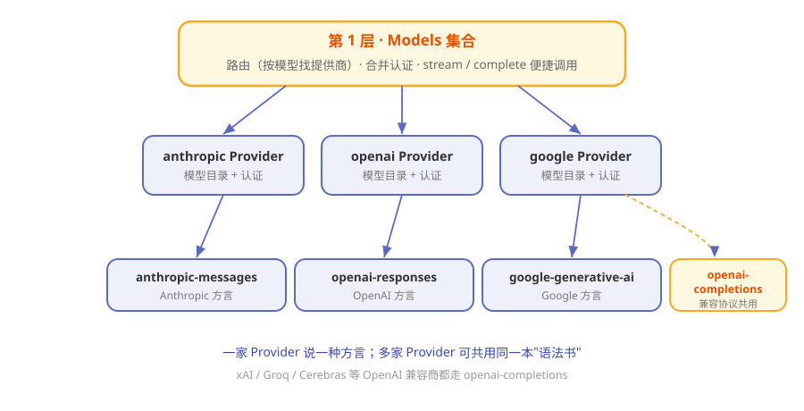

# 第4章 30 家大模型的普通话：pi-ai 统一层

> **阅读提示**
> 本章讲 Pi 的"翻译层"——它怎么让一套代码跟 30 多家大模型都能说上话。读完你会明白"换模型"为什么在 Pi 里只是一件小事。约 9 分钟。

## 一个会说 30 种方言的翻译

想象你雇了一位全能翻译。你对他说中文，他转头就能用英语、法语、日语、阿拉伯语跟不同的人交谈——而你永远只说中文。

Pi 里的 `pi-ai` 包就是这样一位翻译。你只管用**一套统一的说法**提需求，它负责把话翻译成 OpenAI、Anthropic、Google 等各家模型听得懂的"方言"，再把回答统一翻译回来。

为什么需要这层？因为各家模型的接口**彼此不兼容**：

**表4-1 各家模型的"方言"差异**

| 差异点 | 表现 |
|---|---|
| 接口地址 | 每家一个不同的 URL |
| 请求格式 | 字段名、结构各不相同 |
| 认证方式 | 有的用 API Key，有的走 OAuth |
| 流式协议 | 往回吐字的格式一家一样 |

没有翻译层，你每接一家模型就得重写一遍代码。有了 `pi-ai`，这些脏活它全包了。

## 三层结构：从"一句话"到"一根网线"

`pi-ai` 内部分三层，一层比一层靠近真正的网络请求：



**图4-1 pi-ai 的三层结构**

**表4-2 三层各管什么**

| 层 | 名字 | 干什么 | 类比 |
|---|---|---|---|
| 第 1 层 | Models 集合 | 路由（按模型找提供商）、合并认证、提供便捷调用 | 翻译社前台 |
| 第 2 层 | Provider | 一家的运行时：模型目录 + 认证 + 流行为 | 驻某国的翻译 |
| 第 3 层 | API 实现 | 真正说"方言"的线协议（anthropic-messages、openai-responses…） | 具体的语法书 |

一个巧妙的地方：**多个 Provider 可以共用同一本"语法书"**。比如 xAI、Groq、Cerebras 这些都走 OpenAI 兼容协议，就复用同一个 `openai-completions` API 实现，不用各写一遍。

## 通用货币：Context 与 Message

翻译层里流通的"通用货币"是两个东西：**Context**（上下文）和 **Message**（消息）。

**表4-3 两种"通用货币"**

| 概念 | 是什么 | 特点 |
|---|---|---|
| Context | 一次会话的全部背景：系统提示 + 消息列表 + 工具 | 纯 JSON，可序列化 |
| Message | 一条消息：用户说的 / 助手答的 / 工具结果 | 三种角色 |

每条 Message 里装的是"内容块"：

**表4-4 消息里的内容块**

| 内容块 | 含义 |
|---|---|
| TextContent | 一段文字 |
| ThinkingContent | 模型的思考过程 |
| ImageContent | 一张图 |
| ToolCall | 一次"我要用工具"的申请 |

因为这些都是纯数据结构、不绑任何厂商，所以才能在 30 家模型之间自由流通。

## 换模型，只是换个名字

有了统一层，"换个模型"就变成了改个参数。大致是这样一种体验（伪代码，看懂意思即可）：

```
models = 注册所有内置提供商()
model  = models.找模型("anthropic", "claude-sonnet")
models.流式(model, 上下文)      # 想要原样方言
models.流式Simple(model, 上下文) # 想要统一选项
```

**表4-5 两种调用姿势**

| 方法 | 给你什么 |
|---|---|
| stream / complete | 用该提供商的"方言"选项，精细控制 |
| streamSimple / completeSimple | 用一套统一选项（如 reasoning 强度），省心 |

> **阅读提示**
> Pi 支持[30 多家提供商](https://pi.dev/docs/latest)，还能用自定义 OpenAI 兼容端点接私有模型。这就是第 2 章"配钥匙"背后能选那么多家钥匙的原因。

## 模型往回吐字：流式

模型回答是**一个字一个字流出来**的，`pi-ai` 把各家的流式格式统一成一套事件：

**表4-6 统一的流式事件**

| 事件 | 含义 |
|---|---|
| start | 开始了 |
| text_delta | 吐出一段正文 |
| thinking_delta | 吐出一段思考 |
| toolcall_delta | 吐出一段工具调用（含部分 JSON） |
| done / error | 结束 / 出错 |

你既可以"边收边处理"（逐事件消费），也可以"等收完拿整条"（直接要最终结果）。而且**出错不崩溃**——错误被编码进流里，标记好原因交给你，而不是半路炸掉。

## 跨家"接力"：上下文中途换模型

因为 Context 是纯 JSON，Pi 还能玩一个别的很多框架做不到的花活：

> **聊到一半，把整段对话从 A 家模型原封不动交给 B 家模型继续。**

就像翻译社里，一位翻译把你前半程的谈话记录递给另一位翻译，无缝接棒。这在"便宜模型打底、关键处换强模型"的场景里特别好用。

## 🧪 本章实验

> **实验 4-1 ★｜认一认三层**
> 目标：对照本章记住 pi-ai 的分层。
> 步骤：不看图，说出三层名字和各自职责。
> 验收：能说出"Models 路由、Provider 单家运行时、API 线协议"。

> **实验 4-2 ★★｜只装翻译层跑一下**
> 目标：体会"统一层可以独立用"。
> 步骤：空目录里 `npm install @earendil-works/pi-ai`，读它 README 的最小示例。
> 验收：你能指出示例里哪一行在"选模型"、哪一行在"发请求"。

## 🤔 思考题

1. ★ 为什么"多个提供商共用一个 API 实现"是个聪明的设计？
2. ★★ 出错时"编码进流"而不是"直接抛异常"，对调用方有什么好处？
3. ★★ 上下文中途换模型，会带来什么潜在风险？

## 📝 小结

- **pi-ai 是翻译层**——一套统一说法，对接 30 多家模型
- **三层结构**——Models 路由 / Provider 单家运行时 / API 线协议
- **通用货币**——Context 与 Message，纯 JSON 不绑厂商
- **换模型 = 改参数**——stream 精细、streamSimple 省心
- **流式统一成事件**——出错不崩，编码进流
- **能跨家中途接力**——上下文可原样换模型继续

翻译层搞定了"跟谁说上话"。下一章看"怎么干活"——一次对话在 Pi 体内的完整旅程。➡️ [第5章 一次对话的完整旅程：agent loop 与事件流](ch05.md)
