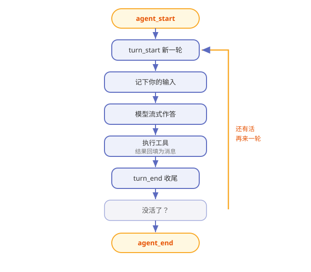

# 第5章 一次对话的完整旅程：agent loop 与事件流

> **阅读提示**
> 本章是全书的主干道：你敲下一句话后，Pi 体内到底发生了什么。我们把这段旅程放慢成一帧一帧。约 10 分钟。

## 一个盯进度的项目经理

把 Pi 的运行时想象成一位项目经理。你跟他说"把这事办了"，他不会只回你一句"好的"，而是：

> 安排一步 → 盯着干完 → 看结果 → 决定下一步 → ……直到没事可干，才回来向你汇报。

这个"安排—盯—看—再安排"的循环，就是 **agent loop**（agent 循环）。它是 `pi-agent-core` 包的心脏。

## 先认识"一轮"：turn

旅程的基本单位叫 **turn（一轮）**：

> **一轮 = 一次调用大模型 + 这一轮里它发起的所有工具执行。**

你的一句话，可能引发好几轮：第一轮模型说"我先读一下文件"，读完第二轮说"我要改这里"，改完第三轮说"好了"。每一轮都是一个完整的"调模型 + 跑工具"循环。

## 完整事件流：一帧一帧看

Pi 把整个旅程拆成一串**事件**（event），按时序往外发。图5-1 是一次带工具调用的对话：

**图5-1 一次对话的事件流**

**表5-1 事件顺序速查**

| 顺序 | 事件 | 发生了什么 |
|---|---|---|
| 1 | agent_start | 整个任务开始 |
| 2 | turn_start | 新一轮开始 |
| 3 | message_start/end | 你的输入被记下 |
| 4 | message_start → update… → end | 模型流式地答（update 是一帧帧增量） |
| 5 | tool_execution_start/update/end | 模型申请的工具被执行 |
| 6 | message_start/end | 工具结果作为新消息入列 |
| 7 | turn_end | 本轮收尾 |
| 8 | （回到 2 或走向 9） | 还有活就再来一轮 |
| 9 | agent_end | 没活了，任务结束 |

**记住这条主线**：模型答 → 若申请工具就执行 → 结果回填 → 再看要不要下一轮。

## 调模型前，上下文先过一道"管道"

每轮要调模型前，Pi 会把手头的消息过一道管道再发出去：

**表5-2 上下文管道三步**

| 步骤 | 干什么 |
|---|---|
| transformContext | 可选：裁剪 / 注入上下文（比如压缩旧对话） |
| convertToLlm | 过滤掉只给界面看的消息，把自定义类型转成模型认的格式 |
| 发给 LLM | 变成第 4 章讲的统一请求 |

> **阅读提示**
> "有些消息只给你看、不给模型看"——这个设计让 Pi 能在界面上画很多东西，却不浪费模型的上下文。第 12 章讲界面时还会碰到它。

## 工具是并行还是串行

一轮里模型可能同时申请好几个工具。Pi 默认**并行**执行它们（快），但允许例外：

**表5-3 两种执行模式**

| 模式 | 行为 | 适合 |
|---|---|---|
| parallel（默认） | 预检串行、执行并行 | 互不干扰的活 |
| sequential | 一个接一个 | 有先后依赖的活 |

你可以全局设，也可以给某个工具单独指定。**只要一批里有一个要求串行，整批就都串行**——宁可慢，不出乱。

## 两种"加塞"：steer 与 followUp

对话进行中，你可能想插话或让它多干点。Pi 给了两个队列：

**表5-4 两种加塞**

| 机制 | 什么时候生效 | 体感 |
|---|---|---|
| steer | 当前工具跑完后、下一轮开始前注入 | "中途递个条子" |
| followUp | agent 本想收工时，排队让它继续 | "别停，再干一件" |

交互模式下，这对应你按 **Enter**（正常发）和 **Alt+Enter**（加塞）的区别。

## 🧪 本章实验

> **实验 5-1 ★｜数一数几轮**
> 目标：亲眼看到"多轮"。
> 步骤：让 Pi 干一件需要读文件再回答的事，观察它先读后答。
> 验收：你能说出"这用了至少两轮"。

> **实验 5-2 ★★｜中途加塞**
> 目标：体验 steer。
> 步骤：Pi 干活中途，用加塞方式补一句要求。
> 验收：它在当前步骤后采纳了你的补充，而不是从头再来。

## 🤔 思考题

1. ★ 为什么把旅程拆成"事件流"，而不是直接返回最终结果？
2. ★★ "一批里有一个串行就整批串行"，为什么这样设计更安全？
3. ★★ steer 和 followUp 的区别，本质上是"插队"插在哪？

## 📝 小结

- **agent loop 是心脏**——安排→盯→看→再安排的循环
- **一轮 = 一次调模型 + 其工具执行**——一句话常引发多轮
- **事件流有固定时序**——agent_start 到 agent_end，中间是 turn 的循环
- **上下文先过管道再发模型**——能裁剪、能过滤界面消息
- **工具默认并行**——有串行需求就整批串行
- **steer / followUp 两种加塞**——中途递条子 / 收工时续活

主干道走通了。下一章聚焦其中"动手"那一段——Pi 的工具。➡️ [第6章 四只手脚：内置工具与工具执行](ch06.md)
