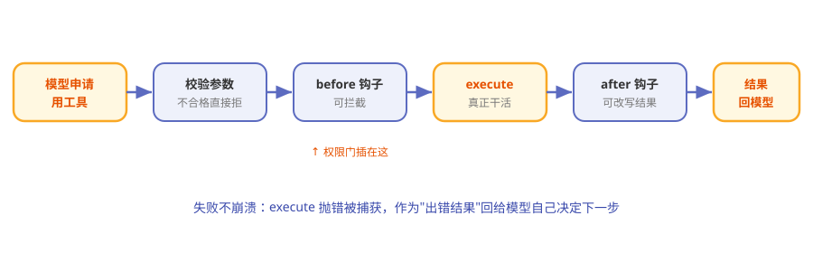

# 第6章 四只手脚：内置工具与工具执行

> **阅读提示**
> 第 1 章说过 Pi 默认只给模型 4 个工具。本章把这"四只手脚"和执行它们的流水线拆开看。约 8 分钟。

## 一个只带四件工具上岗的员工

想象一位新员工的工位上只放了四件工具：一本书（读）、一支笔（写）、一块橡皮（改）、一个按钮（执行命令）。老板（模型）想用别的？可以，但得**自己申请添置**，而不是公司预先塞满他的抽屉。

这就是 Pi 的工具哲学：**默认极简，需要再加。**

## 一个工具长什么样

在 Pi 里，每个工具就是一份标准描述：

**表6-1 工具的五个要素**

| 要素 | 是什么 | 类比 |
|---|---|---|
| name | 工具名 | 工牌 |
| description | 干什么用（给模型看的） | 岗位说明书 |
| parameters | 参数定义（严格校验） | 表格的必填项 |
| execute | 真正干活的逻辑 | 双手 |
| label | 界面上显示的名字 | 胸牌 |

模型只能看到"说明书"，真正动手的是 `execute`。参数会先被严格校验，不合格根本轮不到执行。

## 内置七个，默认开四个

Pi 其实定义了 7 个内置工具，但默认只启用 4 个：

**表6-2 内置工具清单**

| 工具 | 干什么 | 默认开？ |
|---|---|---|
| read | 读文件 | ✅ |
| write | 写新文件 | ✅ |
| edit | 改已有内容 | ✅ |
| bash | 跑命令 | ✅ |
| grep | 搜内容 | ⬜ 按需 |
| find | 找文件 | ⬜ 按需 |
| ls | 列目录 | ⬜ 按需 |

为什么默认就这四个？因为**读写改 + 跑命令**已经构成了"能干绝大多数活"的最小集，剩下的按场景开，保持精简。

## 工具执行流水线

模型说"我要用某工具"之后，会走一条流水线：

**图6-1 工具执行流水线**

**表6-3 流水线四站**

| 站 | 干什么 |
|---|---|
| 校验参数 | 按定义检查，不合格直接拒 |
| beforeToolCall 钩子 | 可拦截、可附理由、可叫停后续 |
| execute 执行 | 真正干活；失败就"抛错"，被捕获后以"出错"结果回给模型 |
| afterToolCall 钩子 | 可改写结果、可追加叫停 |

两个"钩子"就是流水线上可以插进去的**检查岗**——这也是第 1 章说的"权限弹窗用扩展自己造"的落点：在 beforeToolCall 里拦危险命令，就是一个权限门。

## 失败不是崩溃，是"告诉模型"

工具执行失败时，Pi 不让程序崩掉，而是把失败**作为一条"出错"的结果**回给模型：

> 模型看到"这一步失败了，原因是 XX"，然后自己决定是重试、换路子，还是告诉你。

这跟第 4 章"错误编码进流"是同一个思想：**异常是信息，不是终点。**

## 快捷跑命令：`!` 与 `!!`

在交互界面里，你不一定要等模型动手——自己也能直接跑命令：

**表6-4 两个快捷符**

| 输入 | 效果 |
|---|---|
| `!命令` | 跑命令，输出**发给模型**看 |
| `!!命令` | 跑命令，输出**不发给模型**（只给你看） |

## 🧪 本章实验

> **实验 6-1 ★｜认全四只手脚**
> 目标：记住默认四工具。
> 步骤：不看表，说出 read/write/edit/bash 各干什么。
> 验收：四个全对。

> **实验 6-2 ★★｜让 Pi 用工具干件实事**
> 目标：观察完整的"申请→执行→回填"。
> 步骤：让 Pi 在某个目录新建一个文件并写一句话。
> 验收：你能说出它用了 write（可能先 read/ls），以及结果怎么回到对话里。

## 🤔 思考题

1. ★ 为什么"默认只开四个工具"反而可能是优点？
2. ★★ beforeToolCall 能拦截工具，这和"权限系统"是什么关系？
3. ★★ 工具失败"回给模型"而不是"直接报错退出"，体现了什么设计观？

## 📝 小结

- **工具 = 一份标准描述**——name/description/parameters/execute
- **内置七个、默认开四个**——read/write/edit/bash 是最小能干集
- **执行走流水线**——校验→before 钩子→执行→after 钩子
- **钩子是权限门的落点**——beforeToolCall 可拦截危险操作
- **失败是信息**——作为出错结果回给模型，不崩程序

手脚看完了。下一章看记忆——这些对话和工具结果，Pi 都记在哪。➡️ [第7章 对话的记忆：会话树与压缩](ch07.md)
