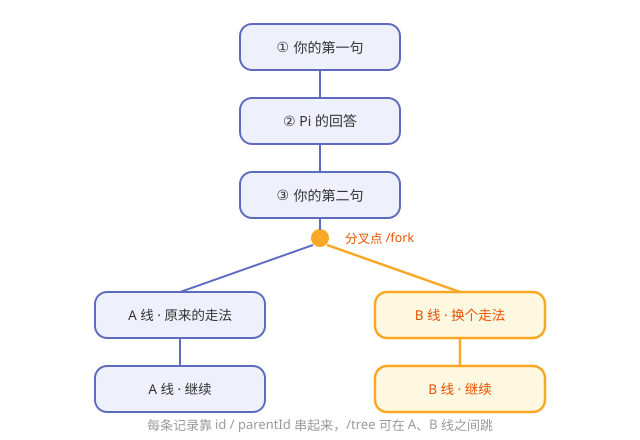

# 第7章 对话的记忆：会话树与压缩

> **阅读提示**
> 模型本身"记不住"，Pi 怎么让它看起来有记忆？本章讲会话日志、树状分枝和上下文压缩。约 9 分钟。

## 一个从不漏记的会议纪要员

大模型是"金鱼记忆"——关掉就忘。但跟 Pi 聊天，它明明记得前面说过的话。秘密不在模型，而在 Pi 身边坐着一位**从不漏记的会议纪要员**。

每一句话、每一次工具调用、每一个结果，这位纪要员都逐条写进账本。下次调模型时，把账本相关内容一起递过去——模型"看起来"就有了记忆。

## 记忆不在脑子里，在账本上

Pi 的账本是一种叫 **JSONL** 的文件：一行一条记录，按时间追加。

**表7-1 账本的特点**

| 特点 | 好处 |
|---|---|
| 一行一条，只追加 | 简单可靠，几乎不会写坏 |
| 存在本地固定目录 | 你的对话数据在你自己机器上 |
| 纯文本 | 随时能打开看、能备份 |

> **阅读提示**
> 第 3 章数据流的"第 7 步两路输出"，其中一路就是这位纪要员在往账本里记账。

## 树状会话：对话能"分叉"

普通聊天记录是一条直线，Pi 的账本却是**一棵树**。每条记录带两个字段：

**表7-2 树的两个关键字段**

| 字段 | 含义 |
|---|---|
| id | 这条记录自己是谁 |
| parentId | 这条记录的"上一条"是谁 |

靠 id 和 parentId 串起来，对话就能**在任意节点原地分叉**——就像读小说读到一半，开一条"如果当时选了另一条路"的平行剧情。

**图7-1 树状会话：从一条线到一棵树**

**表7-3 配套的三个命令**

| 命令 | 干什么 |
|---|---|
| /tree | 打开会话树，在分叉间跳来跳去 |
| /fork | 从当前点开一条新分叉 |
| /clone | 复制一份会话 |

## 上下文会爆，所以要"压缩"

账本越记越长，但模型的"脑容量"（上下文窗口）是有限的。对话一长，就会装不下。

Pi 的解法是**压缩（compaction）**：把前面一大段对话，浓缩成一份简短摘要，用摘要替代原文继续。

**表7-4 压缩的两种方式**

| 方式 | 何时发生 |
|---|---|
| 自动 | 快到上下文上限时自动触发 |
| 手动 | 你觉得该整理时主动触发 |

> **阅读提示**
> 第 5 章提过上下文管道里的 transformContext——压缩就是在那里发生的典型操作。第 8 章你还会看到"压缩策略本身也能用扩展自定义"。

## 想换更结实的账本？SQLite 后端

默认账本是 JSONL 文件，够用。如果你想要更强的检索（比如全文搜索历史对话），Pi 提供可选的 **SQLite 后端**（`session-backends` 包）。

这正呼应第 3 章的设计母题：**可选能力单独成包**——想用 SQLite 就装它，不想用核心一点不受影响。

## 🧪 本章实验

> **实验 7-1 ★｜找到你的账本**
> 目标：亲眼看到记忆存在哪。
> 步骤：和 Pi 聊几句后，去用户主目录下的 `.pi/agent/sessions/` 找找最新的 `.jsonl` 文件，打开看几行。
> 验收：你能指认"这一行就是刚才那句对话"。

> **实验 7-2 ★★｜开一条分叉**
> 目标：体验树状会话。
> 步骤：聊到中途用 /fork 开一条分叉，说点不一样的，再用 /tree 在两条线之间切换。
> 验收：你能在两条"平行剧情"间来回跳。

## 🤔 思考题

1. ★ 为什么说"模型的记忆其实是 Pi 替它记的"？
2. ★★ 树状会话比直线聊天记录，多出来的能力值在哪？
3. ★★ 压缩用"摘要替代原文"，可能会损失什么？

## 📝 小结

- **模型记不住，Pi 替它记**——逐条写进 JSONL 账本
- **账本简单可靠**——一行一条、本地存、纯文本
- **会话是棵树**——id/parentId 支持原地分叉，/tree /fork /clone 配套
- **上下文会爆，用压缩**——摘要替代原文，自动或手动
- **想要强检索换 SQLite 后端**——可选能力单独成包

第二部分到此，Pi 的核心器官（翻译层、循环、工具、记忆）都拆完了。下一部分进入 Pi 最有辨识度的灵魂——自我扩展。➡️ [第8章 Extensions：教 Pi 学新本事](ch08.md)
