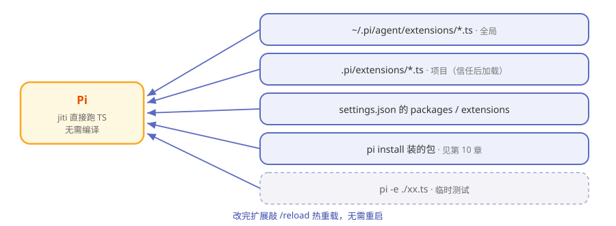

# 第8章 Extensions：教 Pi 学新本事

> **阅读提示**
> 本章是 Pi 的灵魂：扩展（extension）到底是什么、能干什么、怎么加载。读懂这章，你就懂了 Pi 为什么敢说"让你完全接管"。约 10 分钟。

## 教新员工一招

回到那个只带四件工具上岗的员工。现在你想让他会"部署上线"。在别的公司，你得改员工手册、走流程、等版本发布。在 Pi 这里，你只要**写一张"技能卡"递给他，他当场就会了**——不用改他的"大脑"，不用重新入职。

这张技能卡，就是 **extension（扩展）**。

## 扩展到底是什么

一个扩展就是**一个 TypeScript 模块**。它导出一个函数，Pi 启动时把一套"接口"（`ExtensionAPI`）递进去，你用这套接口就能给 Pi 添本事：

```
export default function (pi) {
  pi.on("tool_call", ...)        // 订阅事件，可拦截
  pi.registerTool({...})          // 注册新工具
  pi.registerCommand("hello", ...) // 注册 /hello 命令
}
```

就这么多。**没有编译步骤**——Pi 用 jiti 直接跑 TypeScript，写完即生效。

## 扩展能干什么

这是 Pi 能力面的总览，你会发现第 1 章"六条故意不做"的活路全在这里：

**表8-1 扩展能扩展的东西**

| 接口 | 能干什么 | 对应"故意不做"的替代 |
|---|---|---|
| registerTool | 加新工具，甚至替换内置工具 | 自定义工具 |
| registerCommand | 加 `/命令` | — |
| registerShortcut / registerFlag | 加快捷键 / 启动参数 | — |
| pi.on(事件) | 拦截/监听各种事件 | 权限弹窗（拦危险命令） |
| registerProvider | 加自定义/OpenAI 兼容模型源 | — |
| 各种 renderer | 自定义界面渲染 | — |
| ctx.ui | 弹窗、确认框、状态栏，甚至接管整块界面 | — |
| pi.appendEntry | 往会话账本写持久记录 | — |

> **阅读提示**
> 官方仓库带了 [79 个扩展示例](https://github.com/earendil-works/pi/tree/main/packages/coding-agent/examples/extensions)，从"你好世界"到"用扩展实现计划模式、子代理、沙箱"，甚至能在终端里玩贪吃蛇。第 1 章说的"计划模式/子代理官方不内置"，这里都有现成的扩展实现。

## 扩展从哪里被找到

Pi 启动时会去几个固定位置"收技能卡"：



**图8-1 Pi 从哪里加载扩展**

**表8-2 五个发现位置**

| 位置 | 作用域 |
|---|---|
| `~/.pi/agent/extensions/*.ts` | 全局，所有项目生效 |
| `.pi/extensions/*.ts` | 当前项目，**项目被信任后**才加载 |
| settings.json 的 packages/extensions | 配置指定 |
| `pi install` 装的包 | 见第 10 章 |
| `pi -e ./xx.ts` | 临时加载，测试用 |

改完扩展敲 `/reload` 就能**热重载**，不用重启 Pi。

## 权力越大，越要盯紧

扩展是拿**你的全部权限**在跑的——它能读你能读的、跑你能跑的。所以：

**表8-3 扩展的安全边界**

| 机制 | 说明 |
|---|---|
| 第三方包先看源码 | 装别人的扩展前，读一遍它干什么 |
| 项目级扩展有信任门 | 项目要先被你 trust，里面的扩展才加载 |
| 事件拦截可做权限门 | 用 beforeToolCall/on 事件拦危险操作 |

这正是第 1 章那句话的另一面：**Pi 把选择权给你，也把责任给了你。**

## 🧪 本章实验

> **实验 8-1 ★｜看一个最小扩展**
> 目标：建立扩展的直观印象。
> 步骤：打开仓库里的 [hello.ts 示例](https://github.com/earendil-works/pi/tree/main/packages/coding-agent/examples/extensions)。
> 验收：你能指出哪一行在"注册命令"。

> **实验 8-2 ★★｜让 Pi 给自己造个扩展**
> 目标：体验"自我扩展"。
> 步骤：对 Pi 说"给我写一个扩展，加一个 /now 命令显示当前时间"，然后 /reload。
> 验收：敲 /now 能出时间——你刚刚让 Pi 教会了自己一招。

## 🤔 思考题

1. ★ 扩展"不用编译、写完即生效"靠的是什么？
2. ★★ 为什么"项目级扩展要先 trust 项目"是个重要的安全设计？
3. ★★★ 如果扩展能替换内置工具，会带来什么可能，又有什么风险？

## 📝 小结

- **扩展 = 一个 TS 模块**——导出函数，Pi 递进 ExtensionAPI
- **jiti 直接跑 TS**——无编译，/reload 热重载
- **能加工具/命令/事件拦截/UI/模型源**——六条"故意不做"的活路全在这
- **五个发现位置**——全局/项目（需信任）/配置/安装包/临时
- **拿你全部权限运行**——第三方的先审源码

下一章看三种更轻的"零件"：Skills、提示词模板和主题。➡️ [第9章 Skills、提示词模板与主题](ch09.md)
