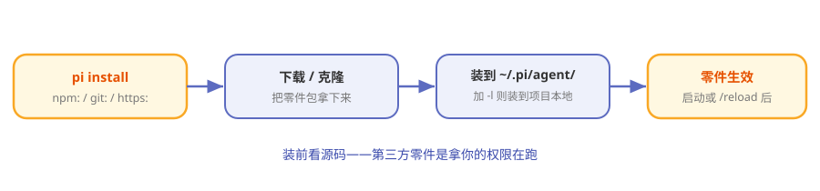

# 第10章 零件市场：Pi Packages

> **阅读提示**
> 扩展和技能都能自己写，但很多别人已经写好了。本章讲 Pi 的"零件市场"——怎么一条命令把社区的零件装进来。约 7 分钟。

## 汽配城

你想给车加个行车记录仪。两条路：自己买零件自己装（上一章的"自己写扩展"），或者**去汽配城，挑个现成的，让师傅几分钟装好**。

Pi Packages 就是那个汽配城。别人把扩展、技能打包成"Pi 包"发布出来，你一条命令装进来就能用。

## 一条命令装零件

安装用 `pi install`，后面跟零件的"出处"：

**表10-1 三种出处**

| 命令 | 从哪装 |
|---|---|
| `pi install npm:包名` | 从 npm 装 |
| `pi install git:仓库地址` | 从 git 仓库装 |
| `pi install https://…` | 从网址装 |

装好后零件就进了 Pi 的发现范围（第 8 章那五个位置之一），启动或 /reload 后生效。

**图10-1 pi install：从市场到你的 Pi**

## 装到哪：全局还是项目

**表10-2 两种安装范围**

| 方式 | 装到哪 | 作用域 |
|---|---|---|
| 默认 | `~/.pi/agent/` 下（npm/ 或 git/） | 全局，所有项目可用 |
| 加 `-l` | 当前项目本地 | 只这个项目 |

跟扩展的发现位置是一套逻辑：全局的到处生效，项目级的只在这一个项目。

## 生态长什么样

Pi 鼓励大家把自己的扩展/技能打包分享。于是你会看到各种现成零件：

**表10-3 社区零件举例**

| 类型 | 例子 |
|---|---|
| 能力扩展 | 权限门、git checkpoint、SSH 执行、沙箱 |
| 玩法扩展 | 计划模式、子代理、问答交互 |
| 彩蛋 | 终端贪吃蛇、Doom 覆盖层 |

> **阅读提示**
> 官方甚至说"让 Pi 自己造扩展"——你造出来觉得好用，就能打包分享给别人。这是"自我扩展"的最后一环：**不止自己扩展自己，还能把扩展分享给所有人。**

## 还是那句话：先看源码

装第三方零件 = 让别人的代码拿你的权限跑。所以汽配城守则第一条没变：

> **装之前，先看它干了什么。**

项目级零件还有 trust 门禁兜底，全局零件就全靠你自己把关了。

## 🧪 本章实验

> **实验 10-1 ★｜看懂安装命令**
> 目标：记住三种出处。
> 步骤：不看表，说出 npm / git / https 三种 `pi install` 写法。
> 验收：三个全对。

> **实验 10-2 ★★｜浏览一次零件市场**
> 目标：感受生态。
> 步骤：在 [npm 搜 @earendil-works](https://www.npmjs.com/search?q=%40earendil-works) 或社区的 pi 扩展仓库逛一圈。
> 验收：你能举出两个"想装来试试"的零件。

## 🤔 思考题

1. ★ 为什么"打包分发"对 Pi 的生态至关重要？
2. ★★ 全局安装和项目级安装（-l），各自适合什么零件？
3. ★★ "让 Pi 造扩展再分享给别人"，这让 Pi 和传统插件市场有什么本质不同？

## 📝 小结

- **Pi Packages 是零件市场**——别人打包，你一条命令装
- **pi install 三种出处**——npm / git / https
- **全局或项目级（-l）**——和扩展发现位置一套逻辑
- **生态自我生长**——Pi 造扩展→打包→分享
- **守则第一条**——装前看源码

第三部分完。你已经懂了 Pi 最有辨识度的灵魂。最后一部分进阶：Pi 的分身术、它的屏幕是怎么画的，以及动手组装你自己的 Pi。➡️ [第11章 Pi 的分身术：四种模式与 SDK 内嵌](ch11.md)
