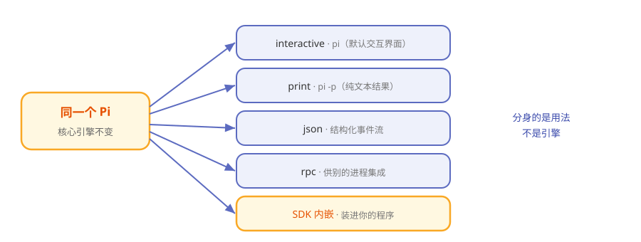

# 第11章 Pi 的分身术：四种模式与 SDK 内嵌

> **阅读提示**
> 你一直用的是"交互模式"的 Pi。其实它有四种"形态"，还能作为 SDK 嵌进你自己的程序。本章讲全。约 8 分钟。

## 同一台车，四种开法

同一台车，可以自己开、可以让代驾开、可以挂上拖车拉货、可以接上电脑自动驾驶。**车还是那台车，用法不同而已。**

Pi 也一样。你平时敲 `pi` 进入的交互界面，只是它最常用的一种形态。它一共有**四种运行模式**，外加一条"内嵌"路径。

## 四种模式一览

**表11-1 Pi 的四种模式**

| 模式 | 怎么触发 | 长什么样 | 适合 |
|---|---|---|---|
| interactive | `pi`（默认） | 完整终端界面，能聊天能 /命令 | 人坐在跟前用 |
| print | `pi -p "…"` | 问一句答一句，纯文本 | 脚本里要个结果 |
| json | `--mode json` | 输出结构化 JSON 事件流 | 程序要解析过程 |
| rpc | `--mode rpc` | stdin/stdout 上的 JSONL 协议 | 别的进程来集成 |

**图11-1 同一台 Pi 的五种用法**



## 前三种：从"给人看"到"给机器看"

interactive、print、json 这三种，是"输出越来越结构化"的一条线：

- **interactive**——给人看的，有界面、有颜色、有快捷键。
- **print**——只给你最终那段文字，方便管道处理（`pi -p "..." > out.txt`）。
- **json**——把第 5 章那串事件，原样以 JSON 吐出来，程序想怎么解析都行。

## rpc：把 Pi 当一个"服务"

rpc 模式更进一步：Pi 在 stdin/stdout 上跑一套 JSONL 协议，**另一个进程**可以像操纵服务一样操纵它——发指令、收事件。这是"把 Pi 嵌进别的系统"的通道。

## 第五条路：SDK 内嵌

如果你干脆在写自己的 Node 程序，想直接把 Pi 的能力装进去，可以不经过命令行，直接用 **SDK**：

```
const runtime = ModelRuntime.create(...)
const session = createAgentSession(...)
await session.prompt("...")
```

三行意思：**建运行时 → 建会话 → 提问**。官方带了 [13 个递进的 SDK 教程](https://github.com/earendil-works/pi/tree/main/packages/coding-agent/examples/sdk)，从最小例子到完全掌控，正好当教材。

**表11-2 五种用法怎么选**

| 你想…… | 用 |
|---|---|
| 坐下来跟它干活 | interactive |
| 脚本里要一句回答 | print |
| 程序要解析全过程 | json |
| 让别的进程驱动它 | rpc |
| 把 agent 能力装进自己的应用 | SDK |

## 🧪 本章实验

> **实验 11-1 ★｜体验 print 模式**
> 目标：感受非交互形态。
> 步骤：运行 `pi -p "用一句话介绍你自己"`。
> 验收：只蹦出回答，没有交互界面。

> **实验 11-2 ★★｜看一眼 JSON 事件流**
> 目标：亲眼看到第 5 章的事件。
> 步骤：`pi --mode json -p "hi"`，观察输出。
> 验收：你能在输出里找到 message 和 turn 相关的字段。

## 🤔 思考题

1. ★ 为什么"同一套核心"要配这么多种模式？
2. ★★ print 和 json 的区别，本质上是给谁看的？
3. ★★ 用 SDK 内嵌和用 rpc 集成，各自适合什么场景？

## 📝 小结

- **四种模式**——interactive / print / json / rpc
- **一条递进线**——从给人看到给机器看
- **rpc 把 Pi 当服务**——别的进程经 JSONL 驱动它
- **SDK 是第五条路**——三行内嵌进自己的 Node 程序
- **核心只有一个**——分身的是用法，不是引擎

下一章看 Pi 的"脸"——那块从不闪烁的终端屏幕是怎么画出来的。➡️ [第12章 终端里的艺术：Pi 的屏幕是怎么画的](ch12.md)
