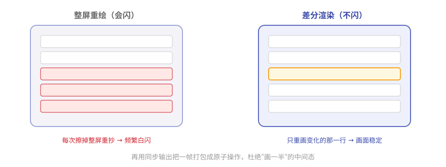

# 第12章 终端里的艺术：Pi 的屏幕是怎么画的

> **阅读提示**
> Pi 的界面流畅不闪烁，跟很多终端工具"刷新就闪瞎眼"完全不同。本章揭秘背后的"差分渲染"。约 8 分钟。

## 一块不闪的黑板

想象两块黑板。

第一块：老师每更新一个字，就把**整块黑板擦掉重抄**。台下只看到一片频繁的白闪。

第二块：老师**只擦掉变了的那几个字，原地重写**。画面始终稳定，几乎看不到闪。

很多终端工具是第一块黑板（每次整屏重绘），Pi 是第二块——它用的技术叫**差分渲染（differential rendering）**，出自 `pi-tui` 包。

## 差分渲染：只画变化的地方

核心思路一句话：

> **渲染时不整屏重画，只找到第一处变化的行，从那里清到行尾、重画变化的行。**

**图12-1 整屏重绘 vs 差分渲染**

再配一招：用终端的"同步输出"协议，把**一帧更新打包成一个原子操作**——要么整帧一起出现，要么不出现，绝不出现画到一半的中间态。这就是"不闪"的完整答案。

**表12-1 三种渲染策略**

| 情况 | 怎么做 |
|---|---|
| 第一帧 | 全量输出 |
| 宽度变了 / 上方有变 | 清屏重绘 |
| 常规更新 | 只刷变化的行 |

## 两块"画布"：主屏与备屏

`pi-tui` 提供两种渲染器，共享一套接口：

**表12-2 两种画布**

| 画布 | 特点 | 适合 |
|---|---|---|
| 主缓冲区 | 保留终端自己的滚动历史 | 输出要能往上翻 |
| 备用缓冲区 | 应用自管滚动，支持布局/鼠标 | 全屏交互界面 |

Pi 的交互模式主要用后者——所以它更像一个"终端里的应用"，而不是"一屏一屏滚的日志"。

## 组件：一个返回字符串行的函数

`pi-tui` 里的组件（编辑器、消息流、选择列表……）都遵循一个极简约定：

> **组件 = 一个 `render(width)` 方法（按宽度返回若干行字符串）+ 可选的输入处理。**

就这么朴素。没有虚拟 DOM，没有复杂框架——把"给我多宽，我画几行字"这件事做到极致。

**表12-3 内置组件举例**

| 组件 | 干什么 |
|---|---|
| Editor | 多行编辑器，自动补全、粘贴折叠 |
| Markdown | 渲染 Markdown，带代码高亮 |
| SelectList | 选择列表 |
| Input | 输入框 |
| Image | 终端里显示图片（Kitty/iTerm2 协议） |

> **阅读提示**
> 第 8 章说扩展能用 `ctx.ui` 自定义界面——用的就是这些 pi-tui 组件。交互模式的整个界面，本质上也是一个 pi-tui 应用。

## 🧪 本章实验

> **实验 12-1 ★｜感受不闪**
> 目标：建立直观对比。
> 步骤：让 Pi 流式输出一长段话，盯住界面。
> 验收：字在涨，但画面不闪不跳。

> **实验 12-2 ★★｜找一个组件**
> 目标：认一个 pi-tui 组件。
> 步骤：在 [pi-tui 源码](https://github.com/earendil-works/pi/tree/main/packages/tui) 里找到 Editor 或 Markdown 组件。
> 验收：你能指出它的 `render` 方法在哪。

## 🤔 思考题

1. ★ 为什么"整屏重绘"会闪，"差分渲染"不会？
2. ★★ 把一帧更新打包成原子操作，解决了什么问题？
3. ★★ 组件就是"返回字符串行的函数"——这种极简有什么好处？

## 📝 小结

- **不闪的秘密是差分渲染**——只重画变化的行
- **同步输出打包成原子帧**——没有画一半的中间态
- **三种策略**——首帧全量 / 变化大清屏 / 常规增量
- **两种画布**——主缓冲区留滚动、备缓冲区做全屏应用
- **组件 = render(width) + 输入处理**——极简到位

最后一章，把学到的用起来——组装你自己的 Pi，并带走这本书的设计智慧。➡️ [第13章 组装你自己的 Pi：后记](ch13.md)
